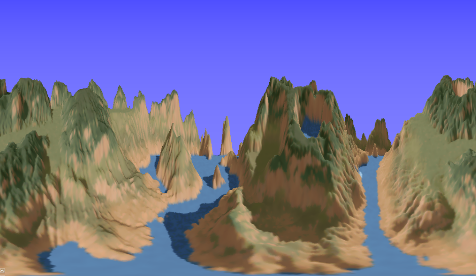

This is a variant of gpu voxel rendering in Desktop GL I did back in 2013.

I first re´nder the landscape in a lat-long like projection (environment map style)

Then I warp it to view it from the perspective I want.

